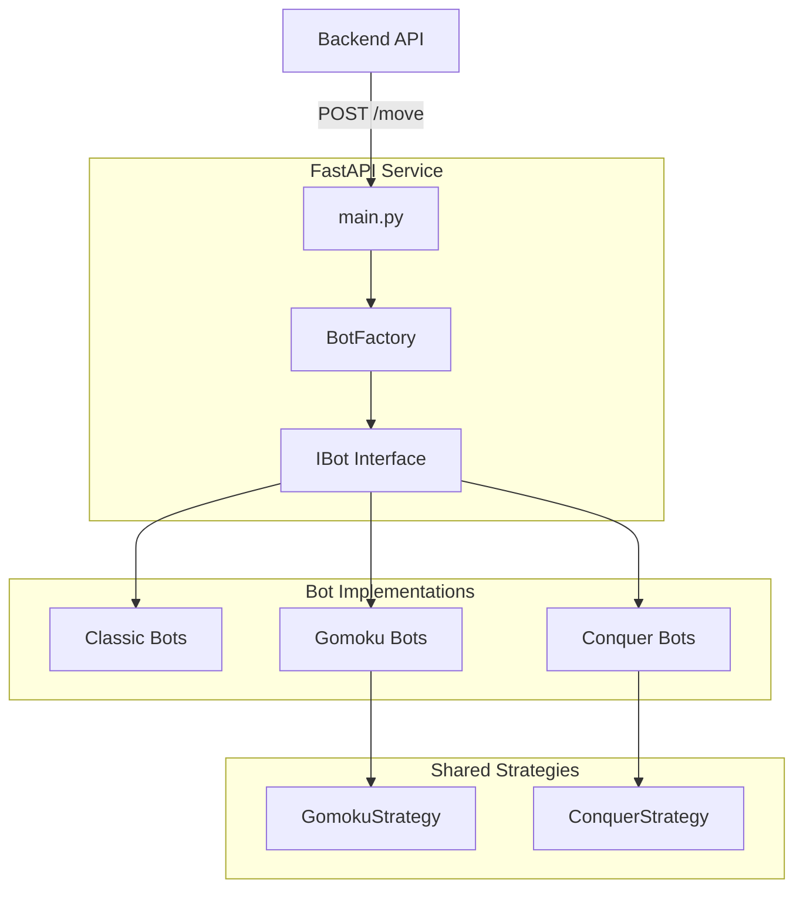
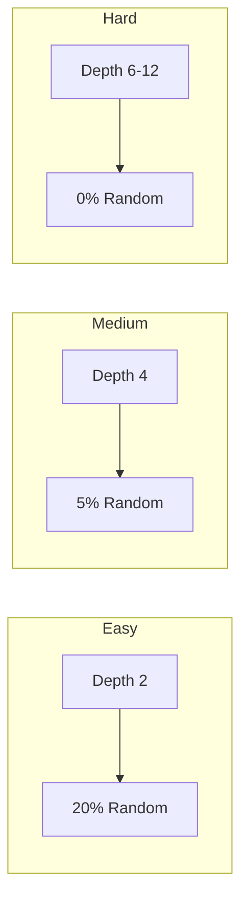

# Conquer-Tac-Toe Autoplayer Service

AI bot service for Conquer-Tac-Toe providing intelligent opponents for all game variants.

## Architecture



## Game Variants & Bots

| Variant ID | Game | Board Size | Bots |
|------------|------|------------|------|
| 1 | Classic Tic-Tac-Toe | 3×3 | Perfect Minimax |
| 2 | Gomoku (5-in-Line) | 10-19×10-19 | Iterative Deepening + VCF |
| 3-5 | Conquer Variants | 3×3 | Minimax + Endgame Solver |

### Difficulty Levels



---

## Bot Implementations

### Gomoku Hard Bot (Expert)

The most sophisticated bot, optimized for large boards with advanced strategic capabilities.

**Core Algorithms:**
- **Iterative Deepening**: Starts at depth 2, increases to 12 based on time
- **Zobrist Hashing**: O(1) transposition table lookups
- **VCF Search**: Victory by Continuous Forcing (depth 20)
- **History Heuristic**: Orders moves by historical performance
- **Killer Moves**: Tracks refutation moves per ply

**Strategic Improvements (Dec 2025):**
- **Own 4-in-a-Row Detection**: Finds bot's winning positions (creates unstoppable threats)
- **Open Threat Analysis**: Distinguishes open (2 ends), semi-open (1 end), and closed (0 ends) threats
- **Smart Fork Blocking**: Prioritizes blocking opponent forks before creating own
- **Fork Detection**: Identifies double 3-in-a-row and 4-in-a-row combination threats
- **Preventive Defense**: Blocks positions that would create opponent forks
- **Priority Rebalancing**: Optimized move ordering for aggressive yet safe play

**Move Priority Order:**
1. Immediate 5-in-a-row win
2. Own 4-in-a-row opportunity
3. Block opponent's 5-in-a-row
4. Block opponent's 3-to-4 extension
5. Block opponent's 4-in-a-row
6. Block opponent's existing fork
7. Create own fork
8. Prevent future opponent forks
9. VCF forcing sequence
10. Iterative deepening search

**Performance:** ~47,000 nodes/4.5s on 15×15 midgame

### Conquer Hard Bot

Designed for the unique cone-placement mechanics.

**Algorithms:**
- **Minimax** with Alpha-Beta (depth 6)
- **Endgame Solver**: Perfect play when ≤9 pieces remain
- **Move Ordering**: Captures → Center → Large cones

### Classic Hard Bot

Unbeatable perfect-play implementation.

**Algorithms:**
- **Full Minimax**: Searches entire game tree
- **Opening Book**: Pre-computed optimal first moves

---

## IBot Interface

All bots implement this interface:

```python
from abc import ABC, abstractmethod
from typing import Dict, Any, Optional

class IBot(ABC):
    @abstractmethod
    def get_move(self, game_state: Dict[str, Any]) -> Optional[Dict[str, Any]]:
        """
        Calculate the next move.

        Args:
            game_state: Dictionary containing:
                - board: 2D list of cells (None or {"player": int, "size": int})
                - player_cones: List[int] - Human's remaining cones
                - bot_cones: List[int] - Bot's remaining cones
                - difficulty: "easy" | "medium" | "hard"
                - variant_id: 1-5
                - board_size: int

        Returns:
            {"row": int, "col": int, "cone_size": int} or None
        """
        pass

    @property
    @abstractmethod
    def name(self) -> str:
        """Display name of the bot"""
        pass
```

---

## Creating a New Bot

### 1. Create Bot Class

```python
# bots/gomoku/my_bot.py
from core.bot_interface import IBot
from typing import Dict, Any, Optional

class MyGomokuBot(IBot):
    @property
    def name(self) -> str:
        return "My Custom Gomoku Bot"

    def get_move(self, game_state: Dict[str, Any]) -> Optional[Dict[str, Any]]:
        board = game_state["board"]
        board_size = len(board)

        # Your logic here...

        return {"row": 7, "col": 7, "cone_size": 0}
```

### 2. Register in main.py

```python
from bots.gomoku.my_bot import MyGomokuBot

@app.on_event("startup")
def startup_event():
    # ... existing registrations ...
    BotFactory.register_bot(2, 'hard', MyGomokuBot())
```

### 3. Best Practices

| Do | Don't |
|----|-------|
| ✅ Keep bot stateless | ❌ Store game history in instance |
| ✅ Handle exceptions gracefully | ❌ Let errors crash the service |
| ✅ Respond within 5 seconds | ❌ Run unbounded searches |
| ✅ Use absolute imports | ❌ Use relative imports |

---

## API Endpoints

### POST /move

Request a bot move.

```json
{
  "game_id": "optional-uuid",
  "board": [[null, {"player": 1, "size": 0}, null], ...],
  "player_cones": [3, 3, 2],
  "bot_cones": [3, 3, 2],
  "difficulty": "hard",
  "variant_id": 3,
  "board_size": 3
}
```

Response:
```json
{"row": 1, "col": 1, "cone_size": 2}
```

### GET /health

Health check endpoint.

---

## Development

### Running Locally

```bash
cd conquertactoe-autoplayer
pip install -r requirements.txt
uvicorn main:app --reload --port 8000
```

### Running Tests

```bash
python -c "
from bots.gomoku.hard_bot import GomokuHardBot
bot = GomokuHardBot()
board = [[None]*15 for _ in range(15)]
board[7][7] = {'player': 1, 'size': 0}
move = bot.get_move({'board': board, 'player_cones': [999], 'bot_cones': [999], 'difficulty': 'hard', 'variant_id': 2, 'board_size': 15})
print(f'Move: {move}')
"
```

### Linting

```bash
flake8 --max-line-length=120 bots/ core/ main.py
```

---

## File Structure

```
conquertactoe-autoplayer/
├── main.py                 # FastAPI app & bot registration
├── db.py                   # ClickHouse logging
├── core/
│   ├── bot_interface.py    # IBot abstract class
│   └── bot_factory.py      # Bot registry
├── bots/
│   ├── classic/            # Classic Tic-Tac-Toe bots
│   │   ├── easy_bot.py
│   │   ├── medium_bot.py
│   │   └── hard_bot.py
│   ├── gomoku/             # Gomoku (5-in-Line) bots
│   │   ├── easy_bot.py
│   │   ├── medium_bot.py
│   │   ├── hard_bot.py
│   │   └── gomoku_strategy.py
│   └── conquer/            # Conquer variants bots
│       ├── easy_bot.py
│       ├── medium_bot.py
│       ├── hard_bot.py
│       └── conquer_strategy.py
└── pdf/                    # Strategy research papers
```
